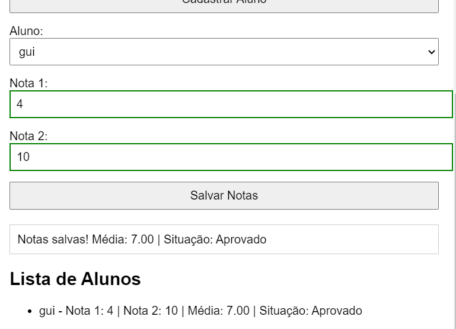

# Validador de Notas

[](https://github.com/GuilhermePaulinoRibeiro/ValidadorDeNotas/actions/workflows/ci.yml)
[](https://sonarcloud.io/summary/new_code?id=GuilhermePaulinoRibeiro_ValidadorDeNotas)

Projeto de formulário HTML para validação de notas, com integração contínua utilizando **Jest**, **SonarCloud** e **GitHub Actions**.

## 🔗 Link do projeto no SonarCloud

[SonarCloud - GuilhermePaulinoRibeiro_ValidadorDeNotas](https://sonarcloud.io/summary/new_code?id=GuilhermePaulinoRibeiro_ValidadorDeNotas)

---

## 🚀 Como executar o projeto localmente

1. **Clone o repositório:**

   ```bash
   git clone https://github.com/GuilhermePaulinoRibeiro/ValidadorDeNotas.git
   cd ValidadorDeNotas
   ```

2. **Instale as dependências:**

   ```bash
   npm install
   ```

3. **Execute os testes com cobertura:**

   ```bash
   npm test
   ```

4. **Abra o formulário no navegador:**

   Basta abrir o arquivo `index.html` em um navegador moderno (Chrome, Firefox, etc.).

---

## 🖼️ Imagem do formulário preenchido

> Substitua a imagem abaixo por um print real do formulário preenchido com o resultado visível.


